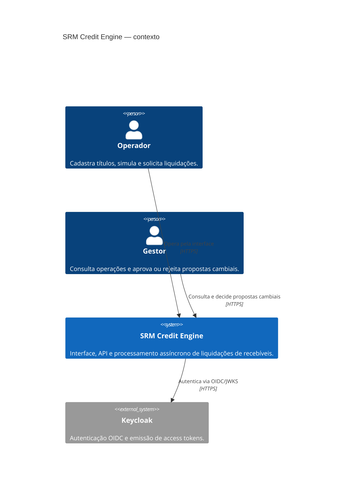
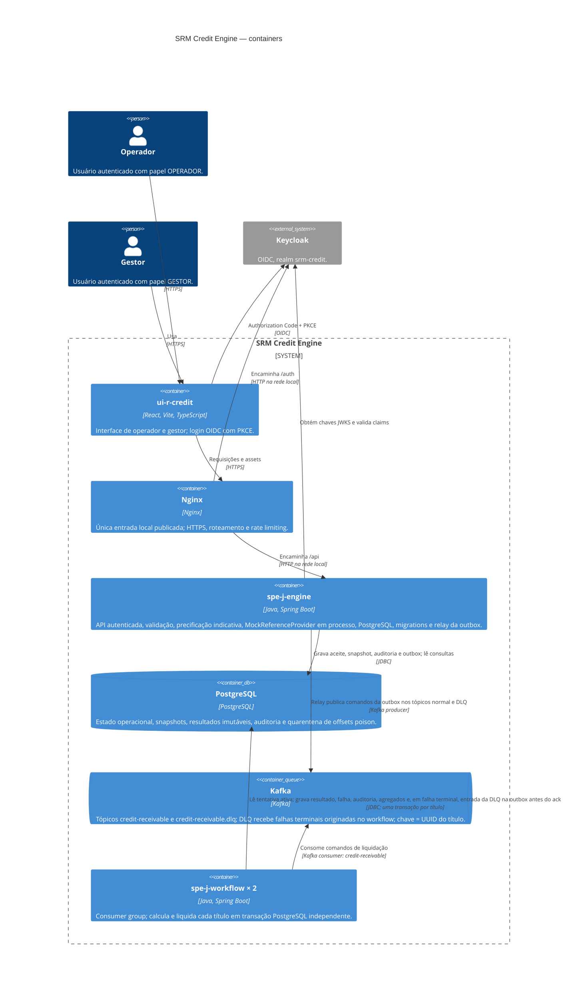

# Arquitetura — SRM Credit Engine

Diagramas C4 níveis 1 e 2 e modelo ER do estado atual do repositório. O ambiente Compose é local; não representa uma topologia de produção ou alta disponibilidade.

## C4 — nível 1: contexto



O sistema registra a aquisição financeira do recebível. Transferência bancária real e gestão de caixa não fazem parte do escopo.
Não há um serviço externo de referência cambial nesta topologia: `MockReferenceProvider` é um componente em processo do engine, com taxa configurável; timeout e retentativas são controlados por `ReferenceService`.

## C4 — nível 2: containers



O engine é o único responsável por aplicar migrations. O workflow verifica compatibilidade antes de consumir. Em falha financeira terminal, após rollback do processamento, o workflow abre uma transação separada para persistir a tentativa como `FAILED`, a auditoria e a mensagem `credit-receivable.dlq` na outbox. O relay do engine publica essa mensagem no Kafka após o commit. Portanto, o workflow origina a entrada da DLQ, mas não publica diretamente no broker. Mensagens malformadas ou sem correlação vão para `settlement_consumer_quarantine` no PostgreSQL e não para o tópico DLQ. O payload normal contém somente `batchUuid`, `receivableUuid`, `requestUuid` e `idempotencyKey`; o snapshot financeiro fica persistido no banco. `MockReferenceProvider` está no processo do engine e não representa outro container, endpoint ou serviço implantável.

## Modelo ER — principais relações

```mermaid
erDiagram
  ASSIGNOR ||--o{ RECEIVABLE : cede
  BATCH ||--|{ RECEIVABLE : contem
  BATCH ||--o{ SETTLEMENT_REQUEST : recebe
  RECEIVABLE ||--|| RECEIVABLE_PROCESSING : possui_estado_atual
  RECEIVABLE ||--o{ SETTLEMENT_REQUEST_ITEM : tenta
  SETTLEMENT_REQUEST ||--|{ SETTLEMENT_REQUEST_ITEM : seleciona
  SETTLEMENT_REQUEST_ITEM o|--o| SETTLEMENT_REQUEST_ITEM : tentativa_anterior
  SETTLEMENT_REQUEST_ITEM ||--o| RECEIVABLE_TERMS : fixa_condicoes
  RECEIVABLE ||--o| SETTLEMENT : liquida_uma_vez
  SETTLEMENT_REQUEST_ITEM ||--o| SETTLEMENT : produz_resultado
  BATCH ||--o{ OUTBOX_MESSAGE : publica
  SETTLEMENT_REQUEST ||--o{ OUTBOX_MESSAGE : origina
  SETTLEMENT_REQUEST_ITEM ||--o{ OUTBOX_MESSAGE : comanda
  BATCH ||--o{ AUDIT_EVENT : audita
  SETTLEMENT_REQUEST ||--o{ AUDIT_EVENT : audita
  SETTLEMENT_REQUEST_ITEM ||--o{ AUDIT_EVENT : audita
  SETTLEMENT_CONSUMER_QUARANTINE {
    uuid uuid PK
    source_topic varchar
    source_partition integer
    source_offset bigint
    key_sha256 char
    value_sha256 char
    failure_code varchar
    date_register timestamptz
  }
  EXCHANGE_RATE_PROPOSAL ||--o| EXCHANGE_RATE : aprova
  EXCHANGE_RATE_PROPOSAL ||--o{ AUDIT_EVENT : audita
  EXCHANGE_RATE ||--o{ AUDIT_EVENT : referencia

  ASSIGNOR {
    uuid uuid PK
    document_number varchar UK
    name varchar
    deleted boolean
  }
  BATCH {
    uuid uuid PK
    active_request_uuid uuid FK
    status varchar
    item_count integer
    version bigint
  }
  RECEIVABLE {
    uuid uuid PK
    batch_uuid uuid FK
    assignor_uuid uuid FK
    external_reference varchar
    type varchar
    face_value_brl numeric
    due_date date
    payment_currency varchar
  }
  RECEIVABLE_PROCESSING {
    uuid uuid PK
    receivable_uuid uuid FK_UK
    active_attempt_uuid uuid FK
    status varchar
    attempt_number integer
    version bigint
  }
  SETTLEMENT_REQUEST {
    uuid uuid PK
    batch_uuid uuid FK
    idempotency_key varchar UK
    request_fingerprint text
    kind varchar
    status varchar
    version bigint
  }
  SETTLEMENT_REQUEST_ITEM {
    uuid uuid PK
    request_uuid uuid FK
    receivable_uuid uuid FK
    previous_attempt_uuid uuid FK
    attempt_number integer
    status varchar
    retry_count integer
  }
  RECEIVABLE_TERMS {
    uuid uuid PK
    attempt_uuid uuid FK_UK
    term_days integer
    spread numeric
  }
  SETTLEMENT {
    uuid uuid PK
    request_uuid uuid FK
    receivable_uuid uuid FK_UK
    attempt_uuid uuid FK_UK
    present_value_brl numeric
    payment_amount numeric
    payment_currency varchar
    settled_at timestamptz
  }
  OUTBOX_MESSAGE {
    uuid uuid PK
    attempt_uuid uuid FK
    receivable_uuid uuid FK
    topic varchar
    status varchar
    payload jsonb
  }
  AUDIT_EVENT {
    uuid uuid PK
    batch_uuid uuid FK
    request_uuid uuid FK
    receivable_uuid uuid FK
    attempt_uuid uuid FK
    event_type varchar
    date_register timestamptz
  }
  EXCHANGE_RATE_PROPOSAL {
    uuid uuid PK
    proposed_rate numeric
    requested_by_subject varchar
    decided_by_subject varchar
    status varchar
  }
  EXCHANGE_RATE {
    uuid uuid PK
    proposal_uuid uuid FK_UK
    rate numeric
    effective_from timestamptz
  }
```

O diagrama resume relações principais; constraints, grants, triggers e índices completos estão nas migrations versionadas em `spe-j-engine/src/main/resources/db/migration`.
